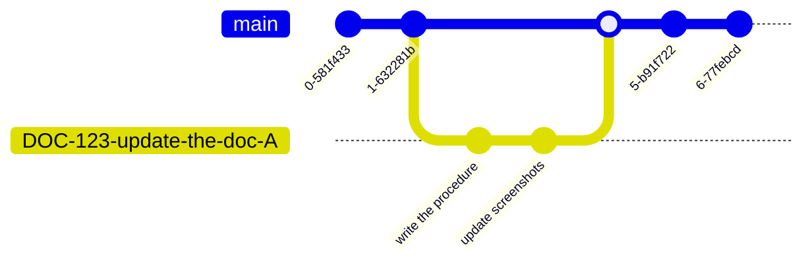

# Another


## Example chapter {id="example-chapter-id"}

Some text.

### Subchapter

Some more text.

## Another chapter {collapsible="true"}
tsetset
sef
s
1. fesf

## ebd
<procedure title="Add something" id="procedure-id">
   <p>Before adding something, create it.</p>
   <step>Do this.</step>
   <step>Do that.</step>
   <p>Congratulation! You've added something.</p>
</procedure>

Lorem ipsum dolor sit amet, consectetur
adipiscing elit, sed do eiusmod tempor
incididunt ut labore et dolore magna
aliqua.
{id="unique-id"}

rers **resr**


In the **c.list** fi

In the <ui-path>c.list</ui-path> fi

In the <path>c.list</path> fi

Press <shortcut>Ctrl+C</shortcut> to copy.

<format style="bold" color="RosyBrown">Hello, world!</format>

[//]: # (&#40;style=[bold, italic, strikethrough, underline, superscript, subscript]&#41;)

```kotlin
    class Person(val name: String) {
        val children: MutableList<Person> = mutableListOf()

        constructor(name: String, parent: Person) : this(name) {
            parent.children.add(this)
        }
    }
```
{collapsible="true" collapsed-title="Person.kt"}


Collapsed by default
{collapsible="true" default-state="collapsed"}
: This is the definition of the second term.


<tldr>
    <p>Shortcut: <shortcut>Ctrl+Space</shortcut></p>
    <p>Configure: <ui-path>Settings / Preferences | Editor | Code Completion</ui-path></p>
</tldr>


> A piece of advice.

> Just FYI.
>
{style="note"}


> You shall
> not pass
>
{style="warning"}

---

You can reference [the JetBrains website][jb] multiple times
and even use [different link text][jb] every time.
Or reference an [anchor][anc].

[jb]: https://www.jetbrains.com
[anc]: #some-id

{ width="450" }

```tex
\begin{equation}
x = \frac{-b \pm \sqrt{b^2 - 4ac}}{2a}
\end{equation}
```


